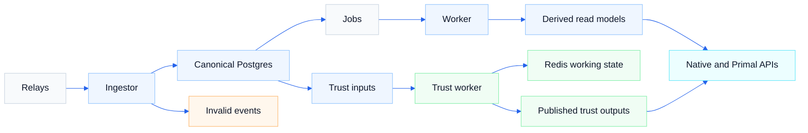

# Architecture

Read this page when you want the system shape before diving into code. It explains what each runtime owns, how data moves through the stack, and why NostrMash keeps canonical ingest truth separate from rebuildable read models.

## On this page

- [Purpose](#purpose)
- [Service boundaries](#service-boundaries)
- [Data flow](#data-flow)
- [Layer model](#layer-model)
- [Versioned derivations and rebuilds](#versioned-derivations-and-rebuilds)
- [Why Postgres is primary](#why-postgres-is-primary)
- [Trust and ranking expansion](#trust-and-ranking-expansion)
- [Trust-bounded canonical ingest](#trust-bounded-canonical-ingest)

## Purpose

NostrMash turns relay traffic into a durable, queryable system without collapsing raw ingest and product-facing read models into the same layer. It stores canonical event truth first, then derives higher-level state asynchronously.

That split is the point: raw history must survive schema changes and bad projection ideas, while read models stay cheap to rebuild and easy to version.

## Service boundaries

| Runtime | What it owns | Why it exists |
| --- | --- | --- |
| `ingestor` | Relay sessions, validation, optional trust-bounded ingest gate, canonical writes, invalid-event quarantine, checkpoints, and job enqueue | Keeps durable ingest truth on the front edge of the system; can shadow or enforce author/target gates before Postgres writes |
| `trust_worker` | Trust-specific job execution, seed reconcile, trust graph snapshot refresh, Redis graph sync, trust score computation, and trust publication | Keeps heavier trust/ranking work isolated; feeds the ingest gate via `trust_graph_snapshot` |
| `worker` | Default queue consumption, derivations, projections, rebuild execution, and engagement raw retention | Turns canonical truth into rebuildable read models; purges aged raw engagement events (kinds 6/7/9735) |
| `api` | Native reads, Primal compatibility, admin inspection endpoints, and API-facing metrics | Exposes product and operator surfaces without owning canonical truth |
| `postgres` | Canonical storage, checkpoints, queue state, derivation metadata, projections, and published trust outputs | Remains the durability and consistency boundary |
| `redis` | Disposable trust working state | Speeds graph-oriented trust computation without becoming canonical state |

## Data flow



```text
relays
  |
  v
ingestor
  |
  +--> validation failure --> invalid_events
  |
  +--> canonical write --> events + event_tags + event_relays
                         |
                         +--> jobs
                               |
                               v
                             worker
                               |
                               v
              derivations / projections / rebuild state
                               |
                               v
                               api
```

The canonical path is synchronous and durable. Derived state is asynchronous by design and may lag behind raw ingest.

Read the diagram as two cooperating paths: the default ingest-to-projection flow that serves most read surfaces, and the trust-specific path that uses Redis as working state but still publishes durable outputs back through shared query surfaces.

## Layer model

| Layer | What it is for | Operational stance |
| --- | --- | --- |
| Layer 1 | Canonical truth and provenance | Durable, inspectable, never shaped for product convenience |
| Layer 2 | Reusable interpreted state and rebuild control | Durable enough to coordinate rebuildable behavior |
| Layer 3 | Read-optimized projections and published outputs | Rebuildable, replaceable, and safe to evolve |

### Layer 1: Canonical Truth

Layer 1 is the durable ingest record:

- `events`: canonical raw event JSON and core fields
- `event_tags`: expanded tag rows
- `event_relays`: relay provenance
- `invalid_events`: quarantined invalid payloads
- `ingest_checkpoints`: per-relay progress for live/backfill

This layer is append-heavy, replayable, and treated as the foundation.

### Layer 2: Derivation State

Layer 2 captures reusable interpreted state derived from raw truth:

- `event_references`, `pubkey_references`
- `replaceable_state`
- `derivation_versions`, `derivation_active_versions`
- `projection_rebuild_runs`

This layer exists to avoid re-parsing the same semantics everywhere and to make rebuild/version control explicit.

### Layer 3: Read Models

Layer 3 is read-optimized projection state consumed by APIs:

- `profiles_latest`
- `author_recent_events`
- `thread_edges`, `unresolved_thread_references`
- `reply_counts`, `reaction_counts`, `repost_counts`
- `reaction_events`, `repost_events`, `deletion_events`
- `contact_lists_latest`, `relay_lists_latest`
- `follower_edges`
- `dm_unread_counts`, `dm_read_cursors`
- `zap_receipts`
- `event_hashtags`
- `note_discovery_stats`
- `profile_public_stats`
- `profile_discovery_stats`
- curated parity tables such as `curated_reads_topics`, `curated_featured_authors`, `curated_recommended_reads`, and `curated_creator_paid_tiers`

Layer 3 is disposable in principle. If a projection is wrong or needs to change shape, rebuild it from lower layers.

## Versioned derivations and rebuilds

Every projection is tied to an explicit derivation name and version. The code tracks:

- compiled version: what the binary knows how to produce
- target version: what operators want the system to converge to
- active version: what the live read path currently serves

Full rebuilds promote a derivation's active version after successful completion. The current implementation also supports narrower rebuild scopes for a single event, a pubkey, or a time range.

This is the core contract: derived state can evolve without rewriting raw history.

## Why Postgres is primary

Postgres is not just storage here. It is the consistency boundary:

- canonical event write, provenance write, and job enqueue happen together
- checkpoints, queue state, rebuild metadata, and projections stay in one transactional system
- operational complexity stays low for early production usage

That design favors correctness and operability over distributed-system novelty.

## Trust and ranking expansion

Trust and ranking are now live repository surfaces in NostrMash, while still remaining active expansion areas.

The design direction is:

- Postgres remains the canonical durability and versioning boundary for ingest truth and published derived outputs
- Redis is available as disposable working state for trust graph synchronization and score computation when Redis sync is enabled; default local deployments can also run the trust pipeline in a Postgres-only graph mode
- trust-specific jobs run in a dedicated `trust_worker`, while published trust outputs flow back through shared query and admin surfaces
- compatibility translation remains boundary-only in `internal/api_primal`; trust outputs should be published through shared query surfaces rather than embedded into transport-specific logic

A few limits are still explicit in the current code:

- `default_v1` is the required built-in relay filter group; additional named groups can be supplied through `INGESTOR_FILTER_GROUPS_JSON`
- compatibility support currently covers the legacy-shaped surface documented in this repository, while future ecosystem-specific additions may still roll out in phases
- trust/ranking continues to expand beyond the currently shipped trust worker, scores, relay suggestions, and trust-targeted ingest scheduling

Use [architecture/trust-subsystem.md](architecture/trust-subsystem.md) for the deeper trust design, [architecture/trust-bounded-ingest.md](architecture/trust-bounded-ingest.md) for the storage-bounding ingest gate and engagement retention layer, and [architecture/orchestration-surfaces.md](architecture/orchestration-surfaces.md) for transport/query ownership on the read side.

## Trust-bounded canonical ingest

After a full firehose refill can exhaust fixed disk in weeks, NostrMash bounds canonical storage at the ingest boundary rather than treating Postgres as an infinite archive.

The model:

- **Trust prerequisites** (`trust_worker`): reconcile `TRUST_SEED_PUBKEYS` into `trust_seeds`, refresh `trust_graph_snapshot` on an interval, and schedule periodic global trust runs.
- **Ingest gate** (`ingestor`): an in-memory trusted-author set loaded from the snapshot gates kind `1` by author trust and kinds `6`/`7`/`9735` by target-exists. Deploy in shadow mode (`INGESTOR_TRUST_GATE_MODE=open`) first, then flip to `trusted_only`.
- **Engagement retention** (`worker`): purge raw engagement events after ~14 days while lifetime aggregate counters survive.

Open kinds (`0`, `3`, `5`, `10002`) still enter canonical storage so the trust graph and profiles can bootstrap. That tradeoff is intentional for the first rollout but is not a permanent spam guarantee.

See [architecture/trust-bounded-ingest.md](architecture/trust-bounded-ingest.md) for gate semantics, env var ownership, metrics, and rollout. See [operations.md](operations.md#trust-bounded-ingest-rollout) for the operator setup checklist.
