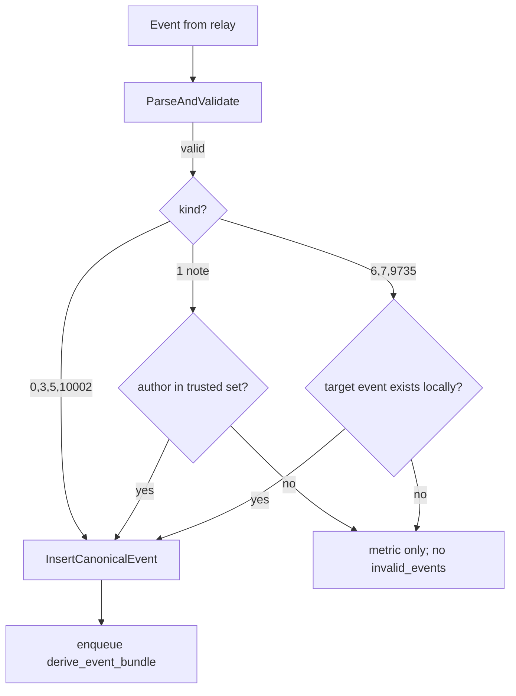

# Trust-bounded canonical ingest

Use this page when you need the full picture for NostrMash's storage-bounding layer: how the ingest gate limits what enters canonical storage, how engagement raw retention caps high-volume exhaust, and how trust prerequisites feed both.

For trust graph computation and score runs, see [trust-subsystem.md](trust-subsystem.md). For operator rollout steps and env var setup, see [../operations.md#trust-bounded-ingest-rollout](../operations.md#trust-bounded-ingest-rollout). For the generated env reference, see [../configuration.md](../configuration.md).

## Problem

On a fixed disk, subscribing to broad relay filters and storing every kind indefinitely refills Postgres in weeks. NostrMash is a local-first indexed system, not an infinite archive. The trust-bounded ingest layer draws the working-set boundary at the web-of-trust subgraph instead of the full firehose.

## Design summary

- Relay subscriptions stay broad (relays cannot filter by author at scale). Enforcement happens locally in the ingest hot path.
- Kinds `0`, `3`, `5`, `10002` remain open so the trust graph can grow and profiles resolve. This is acceptable for the first rollout, not a permanent guarantee against kind-0/3 spam.
- Kind `1` notes are hard-gated: persist only when the author is in the trusted set.
- Kinds `6`, `7`, `9735` are kept only when their target event already exists locally (engagement on already-stored/trusted content). Engagement that arrives before its target is dropped permanently in v1 (no pending buffer).
- Raw engagement events are purged after a short retention window. Lifetime aggregate counters (`reaction_counts`, `repost_counts`) survive because they have no FK to `events`.

## Components

### Trust prerequisites (`trust_worker`)

The gate reads `trust_graph_snapshot`, not live follower edges on every event.

| Component | Env / location | Role |
| --- | --- | --- |
| Seed reconcile | `TRUST_SEED_PUBKEYS` → `trust_seeds` | On startup, `trust_worker` upserts configured seeds and deactivates seeds no longer in the list. Skipped when `TRUST_SEED_PUBKEYS` is empty (manual SQL seeding still works). |
| Snapshot refresh | `TRUST_GRAPH_SNAPSHOT_REFRESH_INTERVAL` (default `10m`) | Rebuilds `trust_graph_snapshot` from active seeds + `follower_edges` BFS up to `TRUST_MAX_HOPS`. Runs once immediately on startup. |
| Global trust runs | `TRUST_RUN_INTERVAL` (default `1h`) | Schedules PageRank-style global score runs when score compute is enabled and no run is active. |

On a fresh database the snapshot is seeds-only until kind-3 contact lists arrive.

### In-memory trusted set (`ingestor`)

| Component | Env | Role |
| --- | --- | --- |
| `TrustedAuthorSet` | `INGESTOR_TRUST_GATE_REFRESH_INTERVAL` (default `2m`) | Loads pubkeys from `trust_graph_snapshot WHERE min_hops <= INGESTOR_TRUST_GATE_MAX_HOPS` (default `2`). Avoids a per-event DB lookup. |
| Last-good retention | — | Failed refreshes keep the previous set; staleness is visible via `nostrmash_ingest_trusted_set_age_seconds`. |
| Fail-closed | `INGESTOR_TRUST_GATE_MODE=trusted_only` | If the set has **never** loaded successfully, kind `1` is rejected. Open kinds and target-local engagement are unaffected so the graph can bootstrap. |

### Ingest gate (`ingestor`)

| Env | Default | Meaning |
| --- | --- | --- |
| `INGESTOR_TRUST_GATE_MODE` | `open` | `open`: shadow mode — record gate metrics, never reject. `trusted_only`: enforce. |
| `INGESTOR_TRUST_GATE_MAX_HOPS` | `2` | Hop distance from a seed for author trust (separate from `TRUST_MAX_HOPS` used elsewhere). |
| `INGESTOR_TRUST_GATE_REFRESH_INTERVAL` | `2m` | How often the in-memory trusted set reloads from Postgres. |

Gate decisions per kind:

- `0`, `3`, `5`, `10002`: always accept.
- `1`: accept iff author in trusted set (or shadow-reject in `open` mode).
- `6`, `7`, `9735`: accept iff target event exists locally (`EventsExist`). Kind `9735` uses the same first-`e`-tag rule as zap derivation.

Rejected events increment metrics only. They are **not** written to `invalid_events` (they are valid Nostr events, just out of scope). The live resume checkpoint still advances so restarts do not re-fetch and re-drop the same span.

### Engagement raw retention (`worker`)

| Env | Default | Meaning |
| --- | --- | --- |
| `WORKER_RETENTION_ENGAGEMENT_ENABLED` | `true` | Enable the engagement purge loop. |
| `WORKER_RETENTION_ENGAGEMENT_MAX_AGE` | `336h` (14d) | Purge raw kinds `6`/`7`/`9735` older than this (by `events.created_at`). |
| `WORKER_RETENTION_ENGAGEMENT_DEAD_GRACE` | `168h` (7d) | Derivation-safety: block purge while `derive_event_bundle` is pending/running, or dead with `updated_at` within this window. |
| `WORKER_RETENTION_ENGAGEMENT_RUN_INTERVAL` | `1h` | Scheduled purge cadence. |
| `WORKER_RETENTION_ENGAGEMENT_DELETE_BATCH_LIMIT` | `2000` | Max rows deleted per batch (auto-paced like job retention). |

Cascade FKs clean contribution/interaction rows. `reaction_counts` / `repost_counts` have no FK and survive.

### Superseded replaceable retention (`worker`)

| Env | Default | Meaning |
| --- | --- | --- |
| `WORKER_RETENTION_REPLACEABLE_ENABLED` | `true` | Enable the superseded-replaceable purge loop. |
| `WORKER_RETENTION_REPLACEABLE_MIN_AGE` | `24h` | A superseded version is only eligible once its `events.first_seen_at` is older than this (protects freshly-ingested/backfilled versions). |
| `WORKER_RETENTION_REPLACEABLE_DEAD_GRACE` | `168h` (7d) | Derivation-safety: block purge while `derive_event_bundle` is pending/running, or dead with `updated_at` within this window. |
| `WORKER_RETENTION_REPLACEABLE_RUN_INTERVAL` | `1h` | Scheduled purge cadence. |
| `WORKER_RETENTION_REPLACEABLE_DELETE_BATCH_LIMIT` | `2000` | Max rows deleted per batch (auto-paced like job retention). |

Purges raw kinds `0`/`3`/`10002` that have been strictly superseded by a newer winner recorded in `replaceable_state` (latest-wins Nostr semantics). The current winner is never deleted, and a newer-but-not-yet-projected version is protected because it ranks above the recorded winner. Cascade FKs clean `event_tags`, `event_relays`, `event_references`, `pubkey_references`, and `follower_edges`; the latest-version projections (`contact_lists_latest`, `relay_lists_latest`, `profiles_latest`, `replaceable_state`) reference the winner and survive. Kind `3` carries the bulk of the savings because superseded contact lists hold the largest tag fan-out.

### Processed deletion retention (`worker`)

| Env | Default | Meaning |
| --- | --- | --- |
| `WORKER_RETENTION_DELETION_ENABLED` | `true` | Enable the processed-deletion purge loop. |
| `WORKER_RETENTION_DELETION_MAX_AGE` | `336h` (14d) | Purge raw kind `5` older than this (by `events.created_at`). |
| `WORKER_RETENTION_DELETION_DEAD_GRACE` | `168h` (7d) | Derivation-safety: block purge while `derive_event_bundle` is pending/running, or dead with `updated_at` within this window. |
| `WORKER_RETENTION_DELETION_RUN_INTERVAL` | `1h` | Scheduled purge cadence. |
| `WORKER_RETENTION_DELETION_DELETE_BATCH_LIMIT` | `2000` | Max rows deleted per batch (auto-paced like job retention). |

Migration `000050` dropped the `deletion_events.event_id` FK cascade, turning `deletion_events` into a durable tombstone ledger. The purge removes raw kind-5 events (and their cascade-cleaned tags/references) once derivation has completed; the `(deleter_pubkey, target_event_id, created_at)` ledger row survives so DM/parity deletion knowledge is preserved.

## Config ownership

| Prefix | Owner | Purpose |
| --- | --- | --- |
| `TRUST_*` | `trust_worker` (+ shared policy) | Seeds, snapshot refresh, global trust runs, graph policy for read surfaces |
| `INGESTOR_TRUST_GATE_*` | `ingestor` | Live ingest enforcement |
| `WORKER_RETENTION_ENGAGEMENT_*` | `worker` | Raw engagement purge |
| `WORKER_RETENTION_REPLACEABLE_*` | `worker` | Superseded replaceable purge (kinds 0/3/10002) |
| `WORKER_RETENTION_DELETION_*` | `worker` | Processed deletion purge (kind 5; tombstone ledger kept) |

`TRUST_CANONICAL_INGEST_MODE` is **deprecated**. It was a config placeholder that was never wired into the ingest hot path. Use `INGESTOR_TRUST_GATE_MODE` instead.

## Observability

Gate metrics (ingestor, bounded labels):

- `nostrmash_ingest_gate_decisions_total{kind,decision}` — `kind` is one of `1`, `6`, `7`, `9735`, `open_kind`, `other`; `decision` is one of `accept`, `reject_untrusted_author`, `reject_missing_target`, `shadow_reject`, `fail_closed`
- `nostrmash_ingest_trusted_set_size`
- `nostrmash_ingest_trusted_set_loaded` (0/1)
- `nostrmash_ingest_trusted_set_age_seconds`

Retention metrics (worker, reuses existing retention vectors):

- `nostrmash_retention_purge_runs_total{target="engagement_events",result}`
- `nostrmash_retention_purged_rows_total{target="engagement_events"}`
- `nostrmash_retention_purge_runs_total{target="replaceable_events",result}`
- `nostrmash_retention_purged_rows_total{target="replaceable_events"}`
- `nostrmash_retention_purge_runs_total{target="deletion_events",result}`
- `nostrmash_retention_purged_rows_total{target="deletion_events"}`

Also watch `nostrmash_ingest_events_total{outcome="gated"}` for cumulative gated events.

## Explicit non-goals (follow-ups)

- Note time-window retention for kind `1` (deferred).
- Optional pending buffer for engagement whose target has not arrived yet.
- Admin seed HTTP endpoints (`/admin/v1/trust/seeds`).
