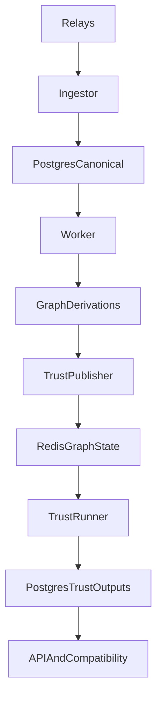

# Trust Subsystem

This document describes the target architecture for a NostrMash trust and ranking subsystem inspired by Vertex-style Web of Trust, while preserving NostrMash's core contract: canonical ingest truth stays durable in Postgres, and published trust outputs remain rebuildable and versioned.

## Goals

- Add trust-aware ranking and filtering without creating a second canonical event pipeline
- Support graph-derived scores such as global rank, seed-based trust, and eventually personalized trust neighborhoods
- Keep fast graph computation and walk maintenance off the critical canonical ingest path
- Publish trust outputs back into the same durable derivation and query model used elsewhere in NostrMash

## Non-Goals

- Replacing Postgres as the primary source of truth
- Running a second independent crawler that competes with `cmd/ingestor`
- Making Redis the only home of trust outputs that APIs depend on

## Design Summary

- Postgres remains the system of record for canonical events, replaceable latest state, checkpoints, jobs, derivation versions, and published trust outputs.
- Redis is allowed as working state for graph adjacency, random walks, score computation, and cache-friendly trust neighborhoods.
- Trust computation should be driven from NostrMash-derived graph inputs such as `contact_lists_latest`, `follower_edges`, and `relay_lists_latest`, not from a parallel ingest path.
- Published trust/ranking results should flow back into Postgres through explicit derivations so they are rebuildable, inspectable, and versioned.

## Existing Inputs In NostrMash

NostrMash already derives graph-relevant inputs from canonical events:

- `contact_lists_latest`: latest kind `3` replaceable state per pubkey
- `follower_edges`: directed follow edges derived from latest contact lists
- `relay_lists_latest`: latest kind `10002` relay-list metadata per pubkey
- optional future enrichment from replies, reposts, zaps, mentions, and moderation state

These inputs are sufficient to build an initial WoT graph without importing an external SQLite/Redis ingest layer.

## Target Data Flow

## Subsystem Components

### 1. Graph Inputs In Postgres

These remain derived and durable:

- `contact_lists_latest`
- `follower_edges`
- `relay_lists_latest`

Optional later inputs:

- interaction edges from replies, reposts, mentions, or zaps
- moderation allow/mute lists
- relay trust or relay-quality signals

### 2. Trust Publisher

A new worker-driven component should publish graph changes from Postgres into Redis. This should be incremental when possible and rebuildable when needed.

Responsibilities:

- read current graph derivations from Postgres
- project adjacency lists, reverse adjacency, and seed metadata into Redis
- support scoped rebuilds and full rebuilds
- stamp version/run metadata so Redis state can be correlated with Postgres derivation state

This can be implemented either:

- as new derivation jobs handled by the existing `worker`, or
- as a dedicated trust worker binary consuming the same Postgres-backed job queue

The second option is preferable if trust computation becomes materially heavier than existing projections.

### 3. Redis Graph State

Redis is working state, not canonical truth.

Suggested contents:

- adjacency and reverse adjacency sets
- trust seed sets
- precomputed global scores
- optional personalized or neighborhood score materialization
- walk state if Monte Carlo / random-walk methods are adopted
- version and run keys tying Redis state to a trust derivation run

Redis keys should be treated as disposable and fully rebuildable from Postgres.

### 4. Trust Runner

The trust runner owns graph algorithms and score production.

Expected responsibilities:

- compute global trust/rank scores
- compute seed-based trust neighborhoods
- optionally maintain incremental walk-based state
- optionally compute per-request or cached personalized scores
- publish finalized scores back into Postgres

Algorithm progression should be staged:

1. simple seed expansion and qualified-follower counts
2. global iterative rank
3. seeded trust neighborhoods
4. optional random-walk or Monte Carlo personalized rank

### 5. Published Trust Outputs In Postgres

Trust outputs should be stored as Layer 3 read models or Layer 2/3 hybrid derivations, not left Redis-only.

Candidate tables:

- `trust_runs`
- `trust_scores_global`
- `trust_scores_seeded`
- `trust_neighborhood_members`
- `trust_pubkeys_latest`
- `relay_trust_scores`

Candidate properties:

- tied to derivation names and versions
- rebuildable from lower layers
- optionally promoteable through active-version switching like other projections
- queryable from `internal/store` and surfaced via `internal/query`

## Query And API Integration

Trust should be exposed through shared application/query surfaces, not embedded directly into `internal/api_primal`.

Recommended layering:

- `internal/store`: read/write trust tables and rebuild metadata
- `internal/query`: expose trust-aware orchestration such as:
  - `GetTrustScore(pubkey)`
  - `GetTrustedNeighborhood(seed, limit)`
  - `GetTrustedFollowers(pubkey, seed, limit)`
  - trust-aware variants of feed/search/profile assembly when needed
- `internal/api` and `internal/api_primal`: remain transport adapters over shared trust-aware query paths

## Relay Discovery And Crawl Prioritization

Vertex-style ideas are still useful, but should attach to NostrMash's pipeline:

- use `relay_lists_latest` to influence relay discovery and allowlist suggestions
- use trust scores to prioritize backfill or targeted fetch work
- use trusted seeds/neighborhoods to shape which pubkeys receive more aggressive crawl effort

Important constraint:

- trust may influence ingest prioritization, but canonical ingest should not stop being durable first

That means trust should bias scheduling and query behavior before it becomes a hard gate on whether raw events are durably written.

## Versioning And Rebuild Model

Trust/ranking should follow the same derivation discipline as the rest of NostrMash:

- explicit derivation names
- compiled, target, and active versions
- scoped and full rebuild support
- durable run metadata

Redis rebuilds should be associated with a trust run identifier so operators can reason about:

- which graph snapshot a score set came from
- whether Redis and published Postgres outputs are in sync
- whether a failed trust run should be retried or rolled back

## Deployment Shape

Two viable deployment shapes:

### Option A: Trust jobs in existing worker

Use the current worker and job queue.

Pros:

- simpler deployment
- fewer binaries and fewer queues
- easiest first implementation

Cons:

- heavy trust workloads may compete with projection jobs
- harder to isolate Redis/ranking failures from normal projection work

### Option B: Dedicated trust worker

Add a dedicated trust service consuming trust-specific jobs.

Pros:

- better isolation for heavy graph work
- easier tuning and rollout
- clearer ownership of Redis-related failures and rebuilds

Cons:

- one more service to operate

Recommended path:

- start with the existing worker if trust publishing is lightweight
- move to a dedicated trust worker once graph/ranking computation becomes materially expensive

## Suggested Rollout Phases

### Phase 1: Postgres-Native Trust Foundation

- add trust seed configuration
- derive simple trusted sets and follower-based qualification from `follower_edges`
- publish trust outputs in Postgres only

### Phase 2: Redis Working Graph

- publish graph inputs into Redis
- compute global scores and seeded neighborhoods
- write results back into Postgres

### Phase 3: Trust-Aware Product Behavior

- trust-aware feed/search/profile ordering
- trust-aware crawl prioritization
- relay recommendation/discovery support

### Phase 4: Advanced Vertex-Style Ranking

- random walks
- Monte Carlo / personalized rank
- richer interaction graph weighting

## Decision Rules

When choosing where a trust feature belongs:

- If it defines canonical event truth: it belongs in Postgres ingest/derivation, not Redis.
- If it is graph working state or iterative algorithm state: Redis is acceptable.
- If an API depends on it for stable product behavior: publish the output back into Postgres.
- If it is transport-specific translation: it belongs in `internal/api` or `internal/api_primal`, but only after shared query/store support exists.

## Recommended Default

The default target architecture for NostrMash trust/ranking is:

- Postgres for canonical truth and published trust outputs
- Redis for graph working state and advanced ranking computation
- worker- or trust-worker-driven synchronization between the two
- no separate SQLite-based ingest pipeline

That captures the useful parts of Vertex-style WoT without abandoning NostrMash's durability and rebuild guarantees.
