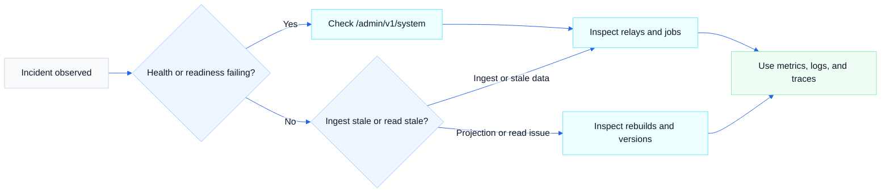

# Operations

Use this page when you are running NostrMash in production or under pressure. Boot validation, health checks, incident triage, rebuild recovery, trust runs, and operator-facing workflows all live here. Use [../README.md](../README.md) for first boot and [observability.md](observability.md) when you need the fuller telemetry catalog.

What this page owns:

- runtime checklists and first-response flow
- interpretation of admin endpoints and operational states
- alert response playbooks
- operator expectations for rebuilds, trust runs, invalid events, and curated data

What it does not try to be:

- a full environment-variable reference; use [configuration.md](configuration.md)
- the full metrics and tracing catalog; use [observability.md](observability.md)
- migration or compatibility policy; use [migrations.md](migrations.md) and [compatibility.md](compatibility.md)

## On this page

- [Operator checklist](#operator-checklist)
- [Running the stack](#running-the-stack)
- [Health and readiness](#health-and-readiness)
- [Key operational concepts](#key-operational-concepts)
- [What to inspect first](#what-to-inspect-first)
- [Troubleshooting flow](#troubleshooting-flow)
- [Backup and restore cautions](#backup-and-restore-cautions)
- [Storage reclamation](#storage-reclamation)
- [SLO-driven triage](#slo-driven-triage)
- [Alert response playbook](#alert-response-playbook)
- [Debug and build identity](#debug-and-build-identity)
- [Trust-bounded ingest rollout](#trust-bounded-ingest-rollout)
- [Contributor handoff checklist](#contributor-handoff-checklist)

## Operator checklist

Start here before diving deeper:

1. Check `GET /health` and `GET /ready`.
2. Check `GET /admin/v1/system` if admin auth is configured.
3. Check `GET /admin/v1/relays` for checkpoint freshness and relay state.
4. Check `GET /admin/v1/jobs` for backlog, retries, and dead jobs.
5. Check `GET /admin/v1/invalid-events` if validation behavior looks off.
6. Check `GET /admin/v1/derivation-versions` and `GET /admin/v1/rebuilds` if projections look stale.



### Example: service looks stale

Use this sequence when the API is up but the data feels behind:

1. Check `GET /ready` to make sure the API still has database connectivity.
2. Check `GET /admin/v1/relays` for stale checkpoints or relay errors.
3. Check `GET /admin/v1/jobs` for backlog, retries, or dead jobs that would slow projection freshness.
4. If raw events appear current but product-facing reads still lag, inspect `GET /admin/v1/derivation-versions` and `GET /admin/v1/rebuilds`.
5. Use [observability.md](observability.md) to decide whether the issue is ingest freshness, queue pressure, DB saturation, or a failing derivation path.

## Trust-bounded ingest rollout

Use this section when enabling the storage-bounding layer after deploy. Full design: [architecture/trust-bounded-ingest.md](architecture/trust-bounded-ingest.md).

### Architecture at a glance

1. **`trust_worker`** writes seeds → refreshes `trust_graph_snapshot` → runs global trust scores.
2. **`ingestor`** loads the snapshot into memory and gates authored kinds `1`/`4`/`9802`/`10000`/`10003`/`30023` (author) and kinds `6`/`7`/`9735` (target-exists) before canonical writes.
3. **`worker`** purges raw engagement events older than ~14 days (lifetime counters survive).

### Required env vars (production)

Set these on the relevant Coolify services or in your Compose env blocks.

**Shared (all services that load trust policy):**

```bash
# Comma-separated hex pubkeys — your WoT roots. Required before trusted_only gate.
TRUST_SEED_PUBKEYS=<hex_pubkey>,<hex_pubkey>
```

**`trust_worker` service:**

```bash
TRUST_GRAPH_SNAPSHOT_REFRESH_INTERVAL=10m
TRUST_RUN_INTERVAL=1h
TRUST_ENABLE_SCORE_COMPUTE=true
# Optional: seeded neighborhoods between compute and promote (default off)
# TRUST_ENABLE_NEIGHBORHOODS=true
# TRUST_NEIGHBORHOOD_MAX_MEMBERS=5000
```

**`ingestor` service — phase 1 (shadow, default):**

```bash
INGESTOR_TRUST_GATE_MODE=open
INGESTOR_TRUST_GATE_MAX_HOPS=2
INGESTOR_TRUST_GATE_REFRESH_INTERVAL=2m
```

**`ingestor` service — phase 2 (enforce, after warmup):**

```bash
INGESTOR_TRUST_GATE_MODE=trusted_only
```

**`worker` service (engagement retention, on by default):**

```bash
WORKER_RETENTION_ENGAGEMENT_ENABLED=true
WORKER_RETENTION_ENGAGEMENT_MAX_AGE=336h
WORKER_RETENTION_ENGAGEMENT_DEAD_GRACE=168h
WORKER_RETENTION_ENGAGEMENT_RUN_INTERVAL=1h
WORKER_RETENTION_ENGAGEMENT_DELETE_BATCH_LIMIT=2000
```

**`worker` service (superseded replaceable retention, on by default):**

```bash
WORKER_RETENTION_REPLACEABLE_ENABLED=true
WORKER_RETENTION_REPLACEABLE_MIN_AGE=24h
WORKER_RETENTION_REPLACEABLE_DEAD_GRACE=168h
WORKER_RETENTION_REPLACEABLE_RUN_INTERVAL=1h
WORKER_RETENTION_REPLACEABLE_DELETE_BATCH_LIMIT=2000
```

Purges raw replaceable events (kinds `0`/`3`/`10002`) once a newer version wins. The current winner and the latest-version projections (`contact_lists_latest`, `relay_lists_latest`, `profiles_latest`, `replaceable_state`) are never touched.

**`worker` service (processed deletion retention, on by default):**

```bash
WORKER_RETENTION_DELETION_ENABLED=true
WORKER_RETENTION_DELETION_MAX_AGE=336h
WORKER_RETENTION_DELETION_DEAD_GRACE=168h
WORKER_RETENTION_DELETION_RUN_INTERVAL=1h
WORKER_RETENTION_DELETION_DELETE_BATCH_LIMIT=2000
```

Purges raw deletion events (kind `5`) after their derivation completes. The distilled `deletion_events` tombstone ledger survives (migration `000050` dropped the `events` FK cascade), so DM/parity deletion knowledge is preserved while the high-volume raw rows and their tags are reclaimed.

### Rollout checklist

**Before first deploy**

1. Choose `TRUST_SEED_PUBKEYS` (at least one well-connected pubkey you trust).
2. Confirm `trust_worker`, `ingestor`, and `worker` share the same `DATABASE_URL`.
3. Leave `INGESTOR_TRUST_GATE_MODE=open` for the first deploy.

**After deploy (shadow period, ~24–48h)**

1. Check `trust_worker` logs for `trust_seed_reconcile_completed` and `trust_graph_snapshot_refreshed`.
2. On ingestor metrics (`METRICS_ADDR`, default `:9090`):
   - `nostrmash_ingest_trusted_set_loaded` should be `1`
   - `nostrmash_ingest_trusted_set_size` should be ≥ seed count (grows as kind-3 edges arrive)
   - `nostrmash_ingest_gate_decisions_total{decision="shadow_reject"}` shows what would be dropped
3. Confirm disk/`events` growth is slowing relative to pre-gate baseline.
4. Confirm worker logs show `engagement_retention_enabled`.

**Flip to enforce**

1. Set `INGESTOR_TRUST_GATE_MODE=trusted_only` on the ingestor and restart.
2. Watch `reject_untrusted_author` and `reject_missing_target` gate decisions — non-zero is expected.
3. Sustained `fail_closed` means the trusted set never loaded; check DB connectivity and `trust_graph_snapshot` before staying in enforce mode.

**Ongoing**

- `nostrmash_retention_purged_rows_total{target="engagement_events"}` — ticks when eligible rows exist.
- `nostrmash_retention_purged_rows_total{target="replaceable_events"}` — superseded kind `0`/`3`/`10002` versions purged; large initial burn-down on first deploy, then low steady-state.
- `nostrmash_retention_purged_rows_total{target="deletion_events"}` — processed kind `5` raw events purged; tombstone ledger rows survive.
- `nostrmash_ingest_trusted_set_age_seconds` — alert if stale (see observability doc).
- `nostrmash_trust_active_snapshot_age_seconds` — global score freshness (separate from gate snapshot).

### Fresh database bootstrap

1. Deploy with `INGESTOR_TRUST_GATE_MODE=open`.
2. Snapshot starts as seeds only; trusted set grows as kind-3 contact lists ingest.
3. Flip to `trusted_only` only when `trusted_set_loaded=1` and size reflects your expected subgraph.
4. Enforce stops new untrusted kind-1 accumulation; it does not retroactively delete existing notes.

### Deprecated

- `TRUST_CANONICAL_INGEST_MODE` — deprecated, not wired. Use `INGESTOR_TRUST_GATE_MODE`.

## Contributor handoff checklist

Before merging/releasing behavior changes, contributors should provide operators with:

1. What changed operationally (routes, config defaults, queue/rebuild behavior, migration impact).
2. Which dashboards/metrics/endpoints should be watched first.
3. Rollback posture (binary-only or requires DB/operator action).

For this handoff, use:

- `migrations.md` for schema risk and rollback-aware guidance
- `compatibility.md` for external behavior/deprecation communication
- `../RELEASE.md` for release notes and rollback expectations

## Running the stack

For the first boot path, use [../README.md](../README.md). The standard containerized command is:

```bash
docker compose up --build
```

This starts:

- `postgres`
- `redis`
- `api` on `:8080`
- `ingestor`
- `worker`
- `trust_worker`

All services run embedded migrations on startup. That means schema mistakes show up immediately during boot, not later.

## Health and readiness

- `GET /health`: liveness only. The process is up.
- `GET /ready`: readiness check for API only. Returns `200` when Postgres is reachable and `503` otherwise.
- `GET /metrics`: Prometheus metrics on the API process.
- `GET /primal/ws`: Primal-compatible WebSocket upgrade endpoint for `REQ`/`CLOSE` traffic.

The ingestor, worker, and trust worker expose metrics on `METRICS_ADDR` when configured. API metrics stay on `HTTP_ADDR` at `GET /metrics`. Use [observability.md](observability.md) when you need the complete metric and tracing catalog rather than the operator-first subset below.

Compatibility gateway tuning:

- `PRIMAL_WS_MAX_SUBSCRIPTIONS` bounds active subscriptions per WebSocket connection.
- `PRIMAL_WS_REQUEST_TIMEOUT` bounds per-request filter processing.
- `PRIMAL_WS_MAX_MESSAGE_BYTES` caps inbound frame size.
- `PRIMAL_WS_MAX_REQ_PER_MINUTE` caps REQ frame rate per connection.
- `HTTP_DM_COMPAT_RATE_LIMIT_RPM` caps `get_directmsgs` compatibility requests per connection.
- `PRIMAL_WS_ALLOWED_ORIGINS` defines explicit browser-origin allowlist.
- `PRIMAL_WS_ALLOW_ANY_ORIGIN` disables origin enforcement when explicitly enabled.

HTTP edge protection tuning:

- `HTTP_RATE_LIMIT_RPM` default per-client rate for public HTTP APIs.
- `HTTP_RATE_LIMIT_BURST` token-bucket burst budget.
- `HTTP_SEARCH_RATE_LIMIT_RPM` tighter override for `/api/v1/search`.
- `HTTP_BATCH_RATE_LIMIT_RPM` tighter override for batch POST endpoints.
- Batch JSON bodies are capped at ~2 MiB and admin JSON bodies at 256 KiB; oversized requests return `413`.

Compatibility WS observability metrics:

- `nostrmash_primal_ws_connections`
- `nostrmash_primal_ws_frames_total{frame_type=...}`
- `nostrmash_primal_ws_requests_total{request_kind=...,outcome=...}`
- `nostrmash_primal_ws_request_duration_seconds{request_kind=...}`

HTTP API observability metrics:

- `nostrmash_api_requests_total{method,path_template,status_code}`
- `nostrmash_api_request_duration_seconds{method,path_template}`

Metrics use route templates (for example `/api/v1/events/{id}`) to avoid label-cardinality explosions; structured request logs still carry both actual and template paths.

Runtime/process and DB pool saturation metrics:

- Go runtime and process collectors are exported on each process metrics endpoint (for example `go_goroutines`, `go_gc_duration_seconds`, `process_cpu_seconds_total`, `process_resident_memory_bytes`).
- DB pool metrics are exported from API and worker processes:
  - `nostrmash_db_pool_open_connections`
  - `nostrmash_db_pool_in_use_connections`
  - `nostrmash_db_pool_idle_connections`
  - `nostrmash_db_pool_max_open_connections`
  - `nostrmash_db_pool_max_open_usage_ratio`
  - `nostrmash_db_pool_wait_count_total`
  - `nostrmash_db_pool_acquire_count_total`
  - `nostrmash_db_pool_acquire_duration_seconds_total`
  - `nostrmash_db_pool_canceled_acquire_count_total`
  - `nostrmash_db_pool_constructing_connections`
- Initial interpretation guidance:
  - A sustained `nostrmash_db_pool_max_open_usage_ratio` above `0.8` means the process is frequently near pool limit.
  - A rising `nostrmash_db_pool_wait_count_total` means callers are queueing for DB connections.
  - High `process_resident_memory_bytes` with increasing `go_goroutines` often indicates workload or leak pressure; correlate with request/job throughput before scaling.
  - Persistent non-zero `nostrmash_db_pool_constructing_connections` with rising waits can indicate churn under pressure.

Critical DB + queue/job latency/error metrics:

- DB operation latency and errors:
  - `nostrmash_db_operation_duration_seconds{operation,result}`
  - `nostrmash_db_operation_errors_total{operation}`
- Queue/job operation latency and errors:
  - `nostrmash_queue_operation_duration_seconds{operation,result}`
  - `nostrmash_queue_operation_errors_total{operation}`
- Worker execution latency:
  - `nostrmash_worker_job_execution_duration_seconds{job_type,outcome}`
- Practical interpretation:
  - If `nostrmash_db_operation_errors_total{operation="insert_canonical_event"}` rises, inspect canonical ingest writes and transaction failures first.
  - If thread-read operations (`get_event_replies`, `get_event_ancestors`, `get_event_raw_by_id`) slow down, inspect DB pool saturation and query/index health.
  - If `nostrmash_queue_operation_errors_total{operation="claim_available"|"complete_job"|"fail_job"}` rises, inspect queue table health, lock contention, and worker connectivity.
  - If worker outcomes in `nostrmash_worker_job_execution_duration_seconds` shift toward `retry`/`dead`, inspect derivation handler errors and queue failure transitions together.

Tracing signals:

- Core flows emit OpenTelemetry spans with `trace_id` correlation in logs.
- API accepts upstream trace context via `Traceparent` and returns `X-Trace-ID` on responses.
- Primary traced boundaries:
  - `http.request`
  - `query.*` orchestration spans
  - `store.*` data-access spans
  - `worker.queue.claim_available` and `worker.job.execute`
  - `ingest.live.handle_event` and `ingest.backfill.*`
- Initial interpretation:
  - If `http.request` is slow and child `store.*` spans dominate, prioritize DB and pool-path investigation.
  - If `worker.job.execute` is slow but store spans are short, prioritize derivation logic and downstream compute paths.
  - If `ingest.backfill.fetch_page` dominates, prioritize relay/network fetch behavior before DB tuning.

Failure taxonomy and panic recovery:

- Failure classes in logs:
  - `client_input`: bad request shape/parameters.
  - `dependency_transient`: timeout/cancel/unavailable dependency.
  - `storage`: Postgres/storage failures.
  - `queue_job`: queue claim/complete/fail and worker job lifecycle failures.
  - `internal_bug`: panic or unexpected internal fault.
- HTTP panic recovery:
  - Panics are recovered and returned as `500` `internal_error`.
  - Structured logs include `failure_class=internal_bug` and request/trace correlation fields.
- Worker panic recovery:
  - Job panics are recovered in worker execution loop.
  - Panicking jobs enter normal failure handling (retry/dead-letter) instead of silently killing worker goroutines.

First-class freshness/backlog/rebuild gauges:

- `nostrmash_ingest_checkpoint_freshness_seconds{mode,filter_group}`
- `nostrmash_worker_queue_backlog_oldest_pending_age_seconds`
- `nostrmash_rebuild_runs_active`
- `nostrmash_rebuild_active_oldest_age_seconds`

Storage/fallback operating gauges and counters:

- `nostrmash_storage_database_bytes`
- `nostrmash_storage_table_bytes{table}`
- `nostrmash_storage_table_rows{table}`
- `nostrmash_lookup_local_total{surface,result}`
- `nostrmash_lookup_fallback_total{entity,result}`
- `nostrmash_lookup_fallback_latency_seconds{entity}`

Fallback `result` is normalized to:

- `attempt`: fallback was attempted for the entity type
- `hit`: fallback recovered at least one requested missing entity
- `miss`: fallback completed but recovered none of the requested missing entities
- `error`: fallback infra/system failure; client-facing response may still degrade to not-found

Fallback labels are intentionally low-cardinality. Do not add relay URL, pubkey, event ID, identifier, or raw error string labels.
Use structured logs for incident details (`query_fallback_lookup_failed` with `entity_type`, `entity_key`/`entity_keys`, `error_class`, and `degraded_to_not_found`).

Storage/retention signal ownership:

- Storage gauges are emitted by the API process (`GET /metrics` on API).
- Retention purge counters (`nostrmash_retention_purge_runs_total`, `nostrmash_retention_purged_rows_total`) are emitted by the worker process (`METRICS_ADDR` when enabled). Targets include `jobs_terminal`, `invalid_events`, `invalid_events_payload`, `engagement_events`, `replaceable_events`, and `deletion_events`.
- Sustained growth slope matters more than one-off size steps after migrations/rebuilds.

Build/runtime identification:

- Each binary logs `build_info` at startup with:
  - `binary_role`
  - `version`
  - `commit`
  - `build_time`
  - `environment`
- The same identity is exposed in metrics via:
  - `nostrmash_build_info{binary_role,version,commit,build_time}`
  - `nostrmash_deployment_info{binary_role,service_name,environment}`

## Key operational concepts

### Relay state

Relay lifecycle and ingest progress are persisted, not held only in memory.

Useful views:

- `GET /api/v1/relays/health`
- `GET /admin/v1/relays`

`/admin/v1/relays` is anchored on durable `ingest_checkpoints` rows. Process memory may be fresher while a relay is actively connected, but persisted checkpoints are the last-known operational truth that survives restarts.

Checkpoint rows currently carry:

- relay identity and scope: `relay_url`, `mode`, `filter_group`
- ingest range markers: `since`, optional `until`, optional `cursor`
- lifecycle status: `status`
- liveness metadata: `updated_at`, optional `eose_seen_at`

After restart, missing live connections do not imply there is no state. Treat rows as stale-but-useful last-known operational truth until new updates arrive.

### Checkpoints

`ingest_checkpoints` are the durable record of where live or backfill ingest last got to for a relay/filter group.

Checkpoint semantics:

- `since` and optional `until` bound the relay history scope
- `cursor` is an optional relay-specific resume marker when backfill needs one
- `updated_at` is the last durable write to the checkpoint row
- `eose_seen_at` records when a relay signaled end-of-stored-events

Statuses in current code:

- `running`
- `completed`
- `failed`
- `paused` exists in the model but is not actively driven by the current ingestor flow

Backfill completion is based on relay EOSE or repeated empty pages when EOSE is not sent.

### Jobs

Jobs live in Postgres and move through:

- `pending`
- `running`
- `succeeded`
- `dead`

The worker claims jobs with `FOR UPDATE SKIP LOCKED`, pushes claimed work to a bounded in-process worker pool, retries failures, and dead-letters after the configured max attempts.
Stale running-job recovery is worker-pool scoped: `worker` only recovers `jobs.worker_pool='default'` and `trust_worker` only recovers `jobs.worker_pool='trust'`.

Worker throughput tuning:

- `WORKER_CONCURRENCY` controls bounded in-process worker pool size (default `4`).
- `WORKER_JOB_RETENTION_ENABLED` enables periodic cleanup of old terminal jobs (default `true`).
- `WORKER_JOB_RETENTION_SUCCEEDED_MAX_AGE` and `WORKER_JOB_RETENTION_DEAD_MAX_AGE` control retention windows.
- `WORKER_JOB_RETENTION_RUN_INTERVAL` and `WORKER_JOB_RETENTION_DELETE_BATCH_LIMIT` bound cleanup cadence and delete volume.
- `WORKER_INVALID_EVENTS_RETENTION_ENABLED` enables periodic cleanup of old `invalid_events` rows (default `true`).
- `WORKER_INVALID_EVENTS_RETENTION_MAX_AGE`, `WORKER_INVALID_EVENTS_RETENTION_RUN_INTERVAL`, and `WORKER_INVALID_EVENTS_RETENTION_DELETE_BATCH_LIMIT` bound invalid-event retention behavior.
- `WORKER_INVALID_EVENTS_PAYLOAD_TRIM_ENABLED` enables optional payload-only trimming (`raw_payload -> NULL`) before full-row retention.
- `WORKER_INVALID_EVENTS_PAYLOAD_TRIM_MAX_AGE` and `WORKER_INVALID_EVENTS_PAYLOAD_TRIM_BATCH_LIMIT` bound payload trimming when enabled.
- `WORKER_RETENTION_ENGAGEMENT_ENABLED` enables periodic purge of raw engagement events (kinds `6`/`7`/`9735`; default `true`).
- `WORKER_RETENTION_ENGAGEMENT_MAX_AGE` (default `336h`/14d), `WORKER_RETENTION_ENGAGEMENT_DEAD_GRACE` (default `168h`/7d), `WORKER_RETENTION_ENGAGEMENT_RUN_INTERVAL`, and `WORKER_RETENTION_ENGAGEMENT_DELETE_BATCH_LIMIT` bound engagement retention. Lifetime `reaction_counts`/`repost_counts` survive; derivation-safe guard blocks in-flight jobs.
- `WORKER_RETENTION_REPLACEABLE_ENABLED` enables periodic purge of superseded raw replaceable events (kinds `0`/`3`/`10000`/`10002`/`10003` and parameterized `30023`; default `true`). Only versions strictly older than the current winner are removed.
- `WORKER_RETENTION_REPLACEABLE_MIN_AGE` (default `24h`, by `first_seen_at`), `WORKER_RETENTION_REPLACEABLE_DEAD_GRACE` (default `168h`/7d), `WORKER_RETENTION_REPLACEABLE_RUN_INTERVAL`, and `WORKER_RETENTION_REPLACEABLE_DELETE_BATCH_LIMIT` bound replaceable retention. The latest-version projections (`contact_lists_latest`, `relay_lists_latest`, `profiles_latest`, `replaceable_state`) survive; derivation-safe guard blocks in-flight jobs.
- `WORKER_RETENTION_DELETION_ENABLED` enables periodic purge of processed raw deletion events (kind `5`; default `true`). The `deletion_events` tombstone ledger survives (migration `000050` dropped the `events` FK cascade).
- `WORKER_RETENTION_DELETION_MAX_AGE` (default `336h`/14d), `WORKER_RETENTION_DELETION_DEAD_GRACE` (default `168h`/7d), `WORKER_RETENTION_DELETION_RUN_INTERVAL`, and `WORKER_RETENTION_DELETION_DELETE_BATCH_LIMIT` bound deletion retention. Derivation-safe guard blocks raw events whose `derive_event_bundle` job is still in-flight, so a tombstone is always projected before its raw event is purged.

Primary inspection endpoint:

- `GET /admin/v1/jobs`

### Rebuilds

Projection rebuilds are first-class operational actions, not ad hoc scripts.

Useful endpoints:

- `GET /admin/v1/rebuilds`
- `POST /admin/v1/rebuilds`
- `GET /admin/v1/derivation-versions`

Full rebuilds are the version-promotion path. Narrow rebuild scopes exist for single-event, pubkey, and time-range repair.

Discovery projection rebuild order (when recovering discovery surfaces end-to-end):

1. `event_hashtags`
2. `note_discovery_stats`
3. `follower_edges` (recomputed from canonical kind `3` events via contact-list derivation)
4. `profile_public_stats`
5. `profile_discovery_stats`

Notes:

- The order keeps dependency ownership explicit (`profile_*` depends on lower-layer interaction/follow projections).
- Rebuilds consume canonical Postgres data and do not require live relay access.
- Truncating these derived tables is safe if you rerun the sequence above.

Author analytics projection rebuild order:

1. `author_activity_daily`
2. `author_engagement_stats`
3. `author_topic_stats`
4. `author_media_mix_stats`
5. `author_activity_windows`
6. `author_posting_patterns`

Conversation projection rebuild order:

1. `thread_projection`
2. `thread_summary`

Trust-aware discovery projection rebuild order:

1. `trusted_note_discovery_candidates`
2. `trusted_profile_discovery_candidates`

Additional notes:

- Analytics and conversation rebuilds depend on canonical `events` plus lower-layer interpreted relationships (`event_references`, `thread_edges`, reactions/reposts/zaps).
- Trust-aware discovery rebuilds depend on canonical discovery projections plus the latest trust snapshot tables (`trust_graph_snapshot`, `trust_scores_global`).
- None of the projection rebuild paths require relay I/O at rebuild time; relay access is ingest-only.

### Trust runs

Trust computation is run by `trust_worker` and publishes durable global trust output into Postgres.

Useful endpoints:

- `POST /admin/v1/trust/runs` to trigger a run
- `GET /admin/v1/trust/runs` and `GET /admin/v1/trust/runs/{runID}` for run status
- `GET /admin/v1/trust/scores` and `GET /api/v1/trust/scores` for score visibility
- `GET /admin/v1/relays/suggestions` for operator-facing trust-weighted relay recommendations

Trust execution phases:

- `trust_sync_graph_redis`: materialize run-scoped graph snapshot keys in Redis from `follower_edges` and active `trust_seeds`
- `trust_compute_global_scores`: run deterministic iterative graph ranking and stage rows for promotion
- `trust_promote_run`: atomically publish staged rows into `trust_scores_global`, clear that run's `trust_scores_global_stage` rows, and mark the run succeeded

If `trust_graph_snapshot_refresh_failed` mentions `trusted_profile_discovery_candidates_pubkey_fkey` / `23503`, deploy migration `000051` (drops parent FKs on trusted discovery candidate tables; soft cleanup remains). Until then the refresh aborts and rolls back.

If `trust_scores_global_stage` is multi-GB with tens of millions of rows, older runs accumulated stage data before promote cleanup existed. Reclaim when no trust promote is in flight:

```sql
-- Safe when no trust run is mid-compute/promote.
TRUNCATE trust_scores_global_stage;
```

After failed/rolled-back discovery refreshes, candidate tables can also bloat with dead tuples (`trusted_note_discovery_candidates` especially). After the FK fix is live and refreshes succeed again, run `VACUUM (VERBOSE) trusted_note_discovery_candidates;` and `VACUUM (VERBOSE) trusted_profile_discovery_candidates;` (or `VACUUM FULL` during a maintenance window for full reclaim).

Operational run metadata:

- `trust_runs.redis_snapshot_ref` links a durable run to the Redis snapshot used for compute
- `trust_runs.last_error` captures terminal failure context when phase execution fails
- `trust_runs.input_follower_edges_count` and `trust_runs.score_rows_published` expose run cardinality
- `trust_runs.current_phase`, `phase_started_at`, `phase_finished_at`, and `phase_last_error` capture phase state
- `trust_runs.sync_job_id`, `compute_job_id`, and `promote_job_id` identify per-phase queue jobs

Trust metrics:

- `nostrmash_trust_queue_backlog_oldest_pending_age_seconds`
- `nostrmash_trust_runs_active`
- `nostrmash_trust_active_oldest_run_age_seconds`
- `nostrmash_trust_active_snapshot_age_seconds`
- `nostrmash_trust_score_rows_published_total`
- `nostrmash_trust_phase_duration_seconds{phase,outcome}`

Trust incidents and recovery:

- If trust jobs are not running, check `jobs.worker_pool='trust'` queue backlog and `trust_worker` process health.
- If a run fails, inspect `trust_runs.last_error`, then retrigger with `POST /admin/v1/trust/runs` once corrected.
- Redis state is disposable working state. If Redis is lost/corrupted, trigger a fresh trust run to rehydrate and republish from Postgres.

Trust-driven ingest prioritization:

- Relay ordering is currently calculated at ingestor startup from `trust_scores_global` + `relay_lists_latest`.
- Use `INGESTOR_TRUST_PRIORITIZATION_ENABLED` and `INGESTOR_TRUST_PRIORITIZATION_TOP_PUBKEYS` to control trust ordering behavior.
- If trust prioritization is disabled or fails, ingest falls back to configured relay order.
- A bounded trust-targeted pubkey frontier can be enabled with `INGESTOR_TRUST_FETCH_ENABLED`; it fetches author-scoped replaceable slices (kinds `0`, `3`, `10002`) from configured relays.
- Frontier behavior is bounded and smoothed by `INGESTOR_TRUST_FETCH_MAX_TRACKED_PUBKEYS`, `INGESTOR_TRUST_FETCH_MAX_SELECTED_PER_CYCLE`, `INGESTOR_TRUST_FETCH_REFRESH_INTERVAL`, `INGESTOR_TRUST_FETCH_STABLE_WINDOW`, and `INGESTOR_TRUST_FETCH_MAX_PROMOTIONS_PER_CYCLE`.
- Retry and fetch pacing are controlled by `INGESTOR_TRUST_FETCH_COOLDOWN` and `INGESTOR_TRUST_FETCH_RETRY_DELAY`; recent lookback is bounded by `INGESTOR_TRUST_FETCH_RECENT_LOOKBACK_SECONDS`.

Trust-bounded ingest gate (storage bounding):

- `INGESTOR_TRUST_GATE_MODE`: `open` (shadow, default) or `trusted_only` (enforce author trust for kind-1 roots and kinds 4/5/9802/10000/10003/30023; kind-1 replies and kinds 6/7/9735 use target-exists).
- `INGESTOR_TRUST_GATE_MAX_HOPS` (default `2`) and `INGESTOR_TRUST_GATE_REFRESH_INTERVAL` (default `2m`) control the in-memory trusted set loaded from `trust_graph_snapshot`.
- Prerequisites on `trust_worker`: `TRUST_SEED_PUBKEYS`, `TRUST_GRAPH_SNAPSHOT_REFRESH_INTERVAL`, `TRUST_RUN_INTERVAL`.
- Rollout guide: [Trust-bounded ingest rollout](#trust-bounded-ingest-rollout).

Trust fetch and suggestion metrics:

- `nostrmash_trust_fetch_frontier_count{state}`
- `nostrmash_trust_fetch_cycles_total{outcome}`
- `nostrmash_trust_fetch_pubkeys_total{outcome}`
- `nostrmash_trust_fetch_pubkeys_selected_total`

### Invalid events

Invalid relay payloads are not dropped silently. They are written to `invalid_events` with error code, message, optional payload, and relay source when available.

If payload trimming is enabled, older rows may keep metadata (`error_code`, `error_message`, relay, timestamps) while `raw_payload` is intentionally cleared to reduce storage pressure.

Primary inspection endpoint:

- `GET /admin/v1/invalid-events`

## What to inspect first

When something breaks, check in this order:

1. Is `api` alive and `ready`?
2. Is Postgres reachable and applying migrations cleanly?
3. Are relay checkpoints moving, stalled, or failing?
4. Is the job backlog growing or are jobs going `dead`?
5. Is the invalid-event rate spiking?
6. Do derivation versions show `rebuild_pending`?

Useful endpoints:

- `GET /health`
- `GET /ready`
- `GET /admin/v1/system`
- `GET /admin/v1/relays`
- `GET /admin/v1/relays/suggestions`
- `GET /admin/v1/jobs`
- `GET /admin/v1/invalid-events`
- `GET /admin/v1/derivation-versions`
- `GET /admin/v1/rebuilds`

## Troubleshooting flow

### API returns `503` on `/ready`

- Check Postgres availability first.
- Check whether startup migrations failed.
- Check `GET /admin/v1/system` once admin auth is configured.

### Ingest appears stalled

- Inspect relay checkpoint freshness.
- Check whether configured relays are disabled or backing off.
- Verify `INGESTOR_RELAY_URLS`, allowlist, and filter group configuration.
- Remember that `default_v1` must always exist and remain the active-safe baseline, even when you provide additional groups through `INGESTOR_FILTER_GROUPS_JSON`.

### Raw events exist but projections look stale

- Check `GET /admin/v1/jobs` for backlog or dead jobs.
- Check derivation versions for `rebuild_pending`.
- Trigger a scoped or full rebuild if the projection logic changed or a worker was down.

If this is a performance regression rather than a correctness regression, check [performance.md](performance.md) for the current evidence-backed tuning log and benchmark commands used for before/after comparison.

### Invalid event volume spikes

- Inspect `GET /admin/v1/invalid-events`.
- Look for relay-specific issues, malformed client traffic, or a validator change.
- Treat spikes carefully before loosening validation, since invalid storage is part of the safety boundary.

## SLO-driven triage

Use [slo.md](slo.md) as the reliability contract, and this page for action-oriented checks.

- API availability/latency SLOs:
  - Start with `nostrmash_api_requests_total` and `nostrmash_api_request_duration_seconds`.
  - Use `http.request -> query.* -> store.*` traces to localize slow/failing segments.
- Ingest freshness SLO:
  - Start with `GET /admin/v1/relays` checkpoint freshness (`updated_at`) and status.
  - Correlate with ingest counters and `ingest.live.handle_event`/`ingest.backfill.*` traces.
- Worker/queue SLO:
  - Start with `nostrmash_worker_jobs_total`, queue operation metrics, and `GET /admin/v1/jobs`.
  - Use `worker.job.execute` and queue/store spans to separate derivation vs queue-state-transition issues.
- Rebuild/replay SLO:
  - Start with `GET /admin/v1/rebuilds` and `GET /admin/v1/derivation-versions`.
  - Correlate with worker queue/store telemetry before changing concurrency or retry policy.

## Alert response playbook

Alert rules are defined in `observability/alerts/core_workflow_alerts.yml`. Use this map for first response:

- `NostrMashAPIHighErrorRate`
  - Meaning: sustained API `5xx` ratio above SLO early-warning level.
  - Check next: per-route `status_code` mix, then `http.request -> query.* -> store.*` traces.
- `NostrMashAPICriticalPathLatencyHigh`
  - Meaning: core read-route p95 latency is above target.
  - Check next: DB pool pressure, then dominant query/store spans by `trace_id`.
- `NostrMashDBPoolSaturation`
  - Meaning: pool is near max-open and callers are waiting.
  - Check next: slow query paths, pool sizing, and concurrent worker/API load.
- `NostrMashWorkerDeadLetterRateHigh`
  - Meaning: dead-letter ratio exceeds worker SLO threshold.
  - Check next: `job_type` with highest dead outcomes, derivation errors, queue transition errors.
- `NostrMashWorkerRetryStorm`
  - Meaning: retries dominate recent job outcomes.
  - Check next: dependency errors, derivation regressions, queue contention.
- `NostrMashQueueClaimErrorsHigh`
  - Meaning: workers are failing to claim jobs reliably.
  - Check next: DB health, lock contention, and queue table pressure.
- `NostrMashIngestLikelyStalled`
  - Meaning: durable live checkpoint freshness is stale for sustained period.
  - Check next: relay checkpoint freshness (`GET /admin/v1/relays`), relay reachability, ingest traces.
- `NostrMashRebuildProcessingSlow`
  - Meaning: one or more active rebuilds are aging beyond expected scoped duration.
  - Check next: `GET /admin/v1/rebuilds`, rebuild active-age gauge, worker queue/store bottlenecks.
- `NostrMashRebuildJobsDead`
  - Meaning: rebuild jobs are dead-lettering; rebuild recovery is failing.
  - Check next: rebuild run status (`GET /admin/v1/rebuilds`), dead-job error payloads, and worker/store traces.
- `NostrMashTrustRunStuck`
  - Meaning: at least one trust run has remained active beyond the expected phase window.
  - Check next: `GET /admin/v1/trust/runs`, current phase metadata/error fields, trust queue health, and `trust_worker` logs.
- `NostrMashTrustSnapshotStale`
  - Meaning: the most recent successful trust snapshot is older than the freshness target.
  - Check next: trigger or inspect `POST /admin/v1/trust/runs`, verify `trust_worker` liveness, and confirm Redis/Postgres trust phases are completing.
- `NostrMashRelayWindowSnapshotStale`
  - Meaning: the homepage `home_window_24h` snapshot is older than 15 minutes (refresh runs every 5m, with one retry on failure).
  - Check next: worker `relay_window_snapshots_refresh_failed` logs (often `statement timeout` on the 7d `event_relays` aggregate under retention IO), worker liveness, and whether a retention catchup is saturating disk. Refresh transactions raise `statement_timeout` to 100s locally; sustained failures usually mean heavier IO contention than a single retry can absorb.
- `NostrMashTrustRetryStorm`
  - Meaning: trust sync/compute/promote phases are retrying at an unhealthy rate.
  - Check next: retry-heavy `job_type` values, trust phase error fields, Redis reachability, and backing store latency.
- `NostrMashFallbackFailureRatioHigh`
  - Meaning: per-entity fallback `error` ratio is elevated relative to `attempt`.
  - Check next: relay availability, timeout/fanout tuning, and `query_fallback_lookup_failed` logs (especially `error_class` + `degraded_to_not_found`).
- `NostrMashFallbackLatencyHigh`
  - Meaning: per-entity fallback p95 latency is elevated.
  - Check next: relay response speed, network path, and fallback timeout budget.
- `NostrMashLocalMissRatioHigh`
  - Meaning: per-surface local cache/index hit ratio degraded for fallback-enabled lookups.
  - Check next: ingest freshness/checkpoints and recent data locality.
- `NostrMashRetentionPurgeFailing`
  - Meaning: worker retention loops are repeatedly erroring.
  - Check next: worker logs for purge target (`jobs` vs `invalid_events`), DB connectivity, and retention env configuration.
- `NostrMashRetentionBatchDurationHigh`
  - Meaning: a retention purge/prune/groom DB operation has sustained high batch p95 latency (6h p95 > 30s for 3h).
  - Check next: `nostrmash:retention:batch_duration_p95_seconds:6h` by `operation`, worker retention logs, and EXPLAIN for that query. Prefer query shapes whose cost is bounded by the batch/backlog, not total table size (no correlated self-EXISTS / full-table GROUP BY on each tick).
- `NostrMashEventTagsJunkCatchupSustained`
  - Meaning: `event_tags` retention is deleting at a sustained catchup rate for 12h+.
  - Check next: ingest allowlist/`ShouldPersist` regressions, whether new junk tag classes are being written, and `event_tags_retention_*` worker logs.
- `NostrMashDatabaseGrowthSustained`
  - Meaning: global database growth rate is elevated for hours.
  - Check next: heavy-table growth (`nostrmash_storage_table_bytes{table}`), retention throughput, and expected ingest/rebuild workload.
- `NostrMashInvalidEventsGrowthHigh`
  - Meaning: `invalid_events` is growing faster than expected.
  - Check next: malformed relay/client sources, validator behavior changes, and invalid-event retention purge effectiveness.
- `NostrMashMeilisearchSyncLagHigh`
  - Meaning: the oldest `pending_meilisearch_syncs` row has been waiting 5m+ for 10m while the queue is non-empty — the sweeper is running but cannot keep up.
  - Check next: Meilisearch CPU/health (`docker stats`, `GET /health`), `WORKER_MEILISEARCH_SWEEPER_*` tuning, and whether a concurrent `FullSync` is competing for the same per-index task queue.
- `NostrMashMeilisearchSweeperStalled`
  - Meaning: no Meilisearch sweeper batch (success or error) has completed in 15m while the queue is non-empty — every sweeper goroutine is hung, not just slow. Seen in production as `pending_meilisearch_syncs` growing for hours with the sweeper's processed counter completely flat.
  - Check next: restart the `worker` container to clear stuck goroutines (queue should start draining within seconds); `WORKER_MEILISEARCH_SWEEPER_BATCH_TIMEOUT` bounds each goroutine so a recurrence should self-heal within that timeout instead of hanging indefinitely. If it recurs, check Meilisearch CPU/health for the underlying cause.

## Debug and build identity

Debug listener configuration:

- `DEBUG_ADDR` enables an auxiliary pprof HTTP server.
- API debug server requires `ADMIN_BEARER_TOKEN`; if token is not configured, API debug server remains disabled even when `DEBUG_ADDR` is set.
- Worker and trust-worker debug servers are unauthenticated; bind only to localhost/private addresses.

Common incident commands:

- CPU profile (30s): `go tool pprof http://<addr>/debug/pprof/profile?seconds=30`
- Heap profile: `go tool pprof http://<addr>/debug/pprof/heap`
- Goroutines dump: `curl http://<addr>/debug/pprof/goroutine?debug=2`

Security/access caveats:

- Never expose debug endpoints on public interfaces without network controls.
- Prefer temporary enablement during incidents.
- Treat profile data as sensitive operational data.

## Backup and restore cautions

Postgres holds more than application data. It also holds queue state, relay checkpoints, invalid payloads, and derivation version metadata.

Operationally that means:

- take consistent Postgres backups
- do not treat projections as the only thing worth preserving
- after restore, prefer rebuilding projections rather than patching tables by hand
- never modify old migration files in place after a database has seen them

If projections are suspect after restore, rebuild them. If canonical raw storage is suspect, treat that as a data integrity incident.

For release-time schema change risk decisions, follow [migrations.md](migrations.md) and [../RELEASE.md](../RELEASE.md) together.

## Storage reclamation

Retention loops DELETE rows, but Postgres does not return that space to the
filesystem: autovacuum marks dead tuples for reuse, so a healthy steady state
is a database that stops growing, not one that shrinks. Migration 000055
tightens per-table autovacuum thresholds on the churn tables so dead-tuple
pressure stays bounded.

Two operator surfaces make this visible:

- `GET /admin/v1/storage` — per-table size, split by canonical / derived /
  operational tiers.
- `GET /admin/v1/storage/indexes` — per-index `idx_scan` counts (evidence for
  index drops, which stay operator-gated) and per-table live/dead tuple counts
  plus last (auto)vacuum times.

### One-time shrink with pg_repack

After first enabling the retention loops on a database that grew unbounded
(months of firehose with no untrusted-author retention, or before the
`pubkey_references` drop), a large fraction of the biggest tables can be dead
space. To actually return it to the filesystem, run
[pg_repack](https://reorg.github.io/pg_repack/) once, online, per table:

```bash
# requires the pg_repack extension and the matching client binary
psql "$DATABASE_URL" -c 'CREATE EXTENSION IF NOT EXISTS pg_repack'
pg_repack --dbname "$DATABASE_URL" --table events --table event_tags \
  --table event_relays --table jobs --table search_documents
```

Notes:

- pg_repack rebuilds tables online (brief exclusive locks at swap time only)
  and needs free disk roughly equal to the table being repacked — run it
  table-by-table under the storage governor's warn threshold, not at 95%.
- Rewriting `events` also re-compresses `raw_json` with LZ4 (migration
  000055), so the first repack typically shrinks more than dead space alone.
- `VACUUM FULL` is the fallback when pg_repack cannot be installed; it takes
  an exclusive lock for the whole rewrite, so schedule downtime for it.
- This is a one-time cleanup. Do not schedule recurring repacks: with
  retention and autovacuum tuned, tables should plateau on their own.

## Curated data operations

Curated compatibility surfaces are operator-seeded. The runtime does not auto-ingest external curation feeds.

Tables backing curated responses:

- `curated_recommended_reads`
- `curated_reads_topics`
- `curated_featured_authors`
- `curated_creator_paid_tiers`

Operational expectations:

- Seed and update curated rows using controlled SQL migrations or operator runbooks.
- Keep curated updates transactional to avoid partial list states.
- Treat empty curated tables as valid empty-state behavior, not incidents.
- Curated cache responses for reads/topics/authors are exposed as kind-wrapped WS payloads (`10000145`/`146`/`148`) with JSON content derived from curated tables.
- `creator_paid_tiers` first tries event-native output (latest kind `17000` plus referenced `e` events) and falls back to curated normalized output (`10000147`) when source events are absent.
- `user_of_ln_address` resolves from `profiles_latest.nip05` and emits kind `10000138`; ensure metadata ingestion is healthy when troubleshooting LN-address lookup gaps.

For deeper telemetry detail, use [observability.md](observability.md). For rollout safety and policy, use [migrations.md](migrations.md), [compatibility.md](compatibility.md), and [../RELEASE.md](../RELEASE.md).
